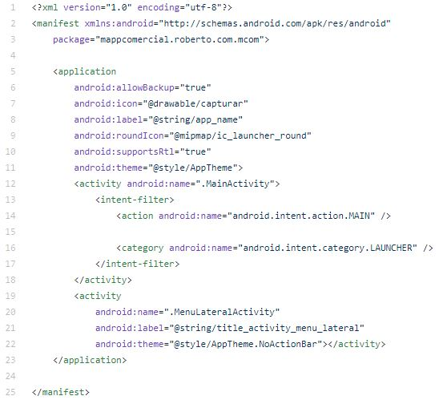

# androcom

## Configurando o Manifest

Como podemos observar o projeto possui apenas duas activity: MainActivity e MenuLateralActivity.

1. A MainActivity basicamente não tem muitas responsabilidades, mas nessa classe foi intanciado um contexto __static__ da mesma para algumas operações que serão demonstradas adiante.

.JPG)

Classe          | Responsabilidade
--------------- | ----------------
MainActivity    | Classe que inicia o app e instancia um contexto da mesma para realizar algumas ações.
