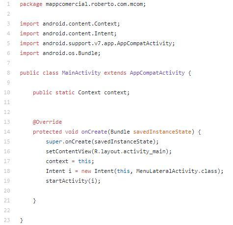
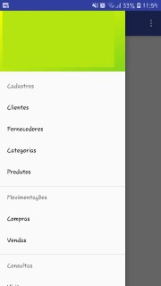

# androcom

## Configurando o Manifest

Como podemos observar o projeto possui apenas duas activity: MainActivity e MenuLateralActivity.

1. A MainActivity basicamente não tem muitas responsabilidades, mas nessa classe foi intanciado um contexto __static__ da mesma para algumas operações que serão demonstradas adiante.

2. A MenuLateralActivity abre o menu lateral da aplicação. Ela é dividida em vários métodos: onCreate, onBackPressed, onCreateOptionsMenu, onOptionsItemSelected e onNavigationItemSelected. Veremos mais adiante foi utilizado cada um dos métodos.

Classe                  | Responsabilidade
----------------------- | ---------------------------------------------------------------------------------------
MainActivity            | Classe que inicia o app e instancia um contexto da mesma para realizar algumas ações.
MenuLateralActivity     | Classe que inicia o app e instancia um contexto da mesma para realizar algumas ações.
